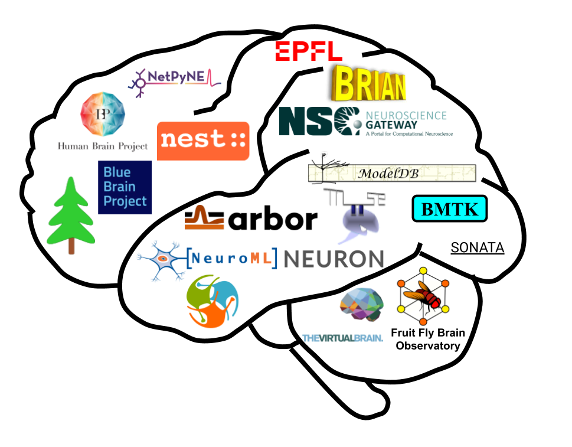

# Workshop at CNS 2020

## Tools and resources for developing and sharing models in computational neuroscience

A workshop to be held at the [29th Annual Computational Neuroscience Meeting](https://www.cnsorg.org/cns-2020). 
CNS 2020 is being held **online** this year. 

### Organizers

- **Kael Dai**, Allen Institute for Brain Science, kaeld@alleninstitute.org 
- **Salvador Dura-Bernal**, State University of New York Downstate, salvador.bernal@downstate.edu
- **Padraig Gleeson**, University College London, p.gleeson@ucl.ac.uk

### Program

Tues 21st July & Wed 22nd July. These will be ~5 hour sessions starting at 07:00 LA; 10:00 NY; 16:00 Berlin. More details to follow.

### Confirmed Speakers

- **Anton Arkhipov**, Allen Institute for Brain Science, USA ([BMTK](https://alleninstitute.github.io/bmtk/)) 
- **Upi Bhalla**, National Centre for Biological Sciences, India ([MOOSE](https://moose.ncbs.res.in/))
- **Luca Bologna**, CNR / Human Brain Project ([HBP BSP](https://www.humanbrainproject.eu/en/brain-simulation/brain-simulation-platform/))
- **Ted Carnevale** and **Serena Thaw-Poon**, Yale University, USA ([ModelDB](https://senselab.med.yale.edu/ModelDB))
- **Ben Cummings**, ETH Zurich, Switzerland ([ARBOR](https://github.com/arbor-sim/arbor))
- **Andrew Davison**, Paris-Saclay Institute of Neuroscience, France ([PyNN](http://neuralensemble.org/PyNN/))
- **Salvador Dura-Bernal**, SUNY Downstate, Brooklyn, USA ([NetPyNE](http://netpyne.org/)) 
- **Padraig Gleeson**, University College London, UK ([NeuroML](http://www.neuroml.org) / [OSB](http://www.opensourcebrain.org)) 
- **Dan Goodman**, Imperial College, UK ([Brian](https://briansimulator.org/)) 
- **Pramod Kumbhar**, EPFL / Blue Brain Project, Switzerland ([coreNEURON](https://neuron.yale.edu/neuron/)) 
- **Aurel Lazar**, Columbia University, USA ([FFBO](http://fruitflybrain.org) & [FBL](https://flybrainlab.github.io))
- **Charl Linssen**, Jülich Supercomputing Centre, Germany ([NEST](https://nest-simulator.org)) 
- **Robert McDougal** and **Lia Eggleston**, Yale University, USA ([NEURON](https://neuron.yale.edu/neuron/) / [ModelDB](https://senselab.med.yale.edu/ModelDB)) 
- **Petra Ritter**, Charité, Berlin, Germany ([TVB](https://www.thevirtualbrain.org), [VirtualBrainCloud](https://virtualbraincloud-2020.eu/))
- **Subhashini Sivagnanam**, San Diego Supercomputer Center, USA ([Neuroscience Gateway](https://www.nsgportal.org))

### Description

This workshop will focus on recent advances in software tools for modeling neurons 
and neuronal networks at different levels of resolution. Neuroscience is experiencing 
a rapid growth of data streams characterizing composition, connectivity, and activity 
of brain networks in ever increasing details. Data-driven modeling will be essential 
to integrate these multimodal and complex data into predictive simulations to advance our 
understanding of brain function and mechanisms. We will bring together representatives of 
many teams that develop computational tools aimed at incorporating and simulating this complexity. 

Major topics for discussion will include the established and emerging computational approaches for 
building and simulating network models, advances in enabling increased access to sophisticated 
modeling for a broad community of users, and sharing and reproducibility of models. 
These discussions will serve to promote the efficiency, reproducibility, and free exchange of 
computational models in the community to support advances in many areas of neuroscience.

### Schedule

A detailed schedule with links to video stream each talk is [available online via Sched.com](https://cns2020online.sched.com/overview/type/Workshop/W04%3A+Tools+and+resources+for+developing+and+sharing+models+in+computational+neuroscience). To view this schedule please [register to the CNS'2020 meeting](https://www.cnsorg.org/cns-2020).

The workshop scheduled is summarized below, with times in the US EASTERN TIME / NY timezone:

