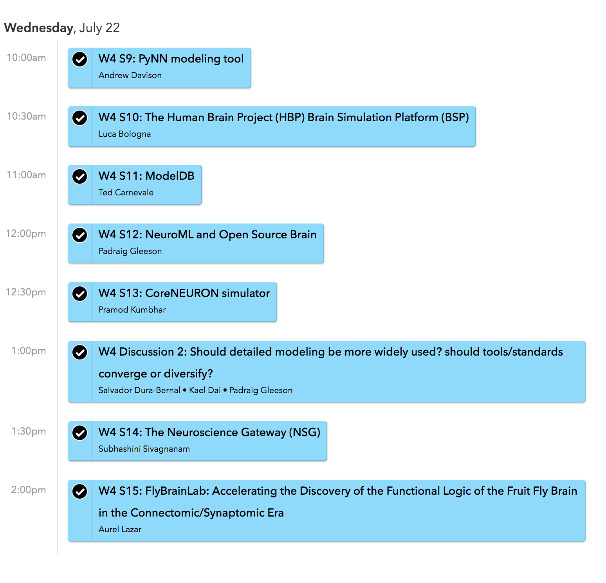

# Workshop at CNS 2020

## Tools and resources for developing and sharing models in computational neuroscience

This workshop was held at the [29th Annual Computational Neuroscience Meeting](https://www.cnsorg.org/cns-2020). 
CNS 2020 was held entirely **online** in 2020. 

### Organizers

- **Kael Dai**, Allen Institute for Brain Science, kaeld@alleninstitute.org 
- **Salvador Dura-Bernal**, State University of New York Downstate, salvador.bernal@downstate.edu
- **Padraig Gleeson**, University College London, p.gleeson@ucl.ac.uk

### Program

##### Day 1: Tues 21st July

- **Upi Bhalla**, National Centre for Biological Sciences, India ([MOOSE](https://moose.ncbs.res.in/))   [[**Slides**](docs/CNS2020/CNS_MOOSE_and_friends.pptx)]
- **Petra Ritter**, Charité, Berlin, Germany ([TVB](https://www.thevirtualbrain.org), [VirtualBrainCloud](https://virtualbraincloud-2020.eu/))
- **Ben Cummings**, ETH Zurich, Switzerland ([ARBOR](https://github.com/arbor-sim/arbor))
- **Charl Linssen**, Jülich Supercomputing Centre, Germany ([NEST](https://nest-simulator.org)) 
- **Dan Goodman**, Imperial College, UK ([Brian](https://briansimulator.org/)) [[**Slides**](docs/CNS2020/Brian.pptx)]
- **Robert McDougal** and **Lia Eggleston**, Yale University, USA ([NEURON](https://neuron.yale.edu/neuron/) / [ModelDB](https://senselab.med.yale.edu/ModelDB)) 
- **Salvador Dura-Bernal**, SUNY Downstate, Brooklyn, USA ([NetPyNE](http://netpyne.org/)) 
- **Anton Arkhipov**, Allen Institute for Brain Science, USA ([BMTK](https://alleninstitute.github.io/bmtk/)) [[**Slides**](docs/CNS2020/CNS_BMTK_Presentation.pptx)]

##### Day 2: Wed 22nd July

- **Andrew Davison**, Paris-Saclay Institute of Neuroscience, France ([PyNN](http://neuralensemble.org/PyNN/)) [[**Slides**](docs/CNS2020/pyNN_cns_2020.pdf)]
- **Luca Bologna**, CNR / Human Brain Project ([HBP BSP](https://www.humanbrainproject.eu/en/brain-simulation/brain-simulation-platform/)) [[**Slides**](docs/CNS2020/Bologna_BSP.pdf)]
- **Ted Carnevale** and **Serena Thaw-Poon**, Yale University, USA ([ModelDB](https://senselab.med.yale.edu/ModelDB)) [[**Slides**](docs/CNS2020/w4_s11_modeldb_carnevale.pdf)]
- **Padraig Gleeson**, University College London, UK ([NeuroML](http://www.neuroml.org) / [OSB](http://www.opensourcebrain.org)) 
- **Pramod Kumbhar**, EPFL / Blue Brain Project, Switzerland ([coreNEURON](https://neuron.yale.edu/neuron/)) [[**Slides**](https://drive.google.com/file/d/1xo-MGWwS4EJVQzKhw3D7mnBlZtDwWaDz/view)]
- **Subhashini Sivagnanam**, San Diego Supercomputer Center, USA ([Neuroscience Gateway](https://www.nsgportal.org))
- **Aurel Lazar**, Columbia University, USA ([FFBO](http://fruitflybrain.org) & [FBL](https://flybrainlab.github.io)) [[**Slides**](docs/CNS2020/lazar_fbl.pdf)]

### Description

This workshop focussed on recent advances in software tools for modeling neurons 
and neuronal networks at different levels of resolution. Neuroscience has been experiencing 
a rapid growth of data streams characterizing composition, connectivity, and activity 
of brain networks in ever increasing details. Data-driven modeling will be essential 
to integrate these multimodal and complex data into predictive simulations to advance our 
understanding of brain function and mechanisms. We brought together representatives of 
many teams that develop computational tools aimed at incorporating and simulating this complexity. 

Major topics for discussion included the established and emerging computational approaches for 
building and simulating network models, advances in enabling increased access to sophisticated 
modeling for a broad community of users, and sharing and reproducibility of models. 
These discussions should serve to promote the efficiency, reproducibility, and free exchange of 
computational models in the community to support advances in many areas of neuroscience.

### Schedule

A detailed schedule with links to video stream each talk was made available [online via Sched.com](https://cns2020online.sched.com/overview/type/Workshop/W04%3A+Tools+and+resources+for+developing+and+sharing+models+in+computational+neuroscience). To view this schedule please [register to the CNS'2020 meeting](https://www.cnsorg.org/cns-2020).

The workshop scheduled is summarized below, with times in the US EASTERN TIME / NY timezone:

