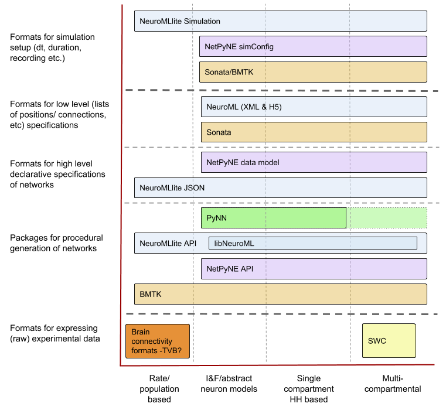

# INCF SIG on Standardised Representations of Network Structures

A number of [Special Interest Groups (SIGs)](https://www.incf.org/activities/special-interest-groups) 
are being supported by the [International Neuroinformatics Coordinating Facility (INCF)](https://www.incf.org) 
to advance areas of common interest within the neuroscience community.  

This SIG deals with the various tools and formats for creating and sharing representations 
of biological neuronal networks, and will work towards ensuring these are as interoperable 
and usable as possible for computational neuroscientists. 

The homepage for this SIG is [here](https://www.incf.org/sig/standardised-representations-network-structures). 
This GitHub repository is intended for documents, code samples, issue tracking and links to related initiatives. 

## Overview

The motivation for this SIG is the ongoing development of complex data-driven models 
of neuronal networks, as well as the emergence of general purpose software packages 
and standardised formats to make it easier to build, specify and share such networks. 
To encourage researchers to use these common tools and formats (and ultimately create 
and disseminate higher quality models) we have gathered together developers creating 
these packages to share code and ideas, to encourage interoperability and have a 
forum for users and developers to find out about the state of the art and to contribute 
to a better ecosystem of tools and standards in this area.

The short term goals focus on highlighting and promoting existing open source initiatives working with network representations. These include, but are not limited to:  

- BMTK, The Brain Modeling Toolkit: https://github.com/AllenInstitute/bmtk 
- NEST: http://www.nest-simulator.org
- NetPyNE: http://www.netpyne.org   
- NeuroML: http://www.neuroml.org; https://github.com/NeuroML/NeuroMLlite 
- NineML: http://www.nineml.net
- PyNN: http://neuralensemble.org/PyNN/ 
- Sonata: https://github.com/AllenInstitute/sonata 
- TVB, The Virtual Brain: http://www.thevirtualbrain.org 

Practical steps will include making sure these are compatible and interoperable where appropriate.

 <i>Some of the formats 
which are being examined in this SIG and their scope in terms of biophysical detail 
(x-axis) and usage in the model building workflow (y-axis).</i>

Longer term goals including working towards minimising overlap in functionality/scope, 
adding other open tools/formats to the interoperability framework and ensuring 
the use of these (particularly low level declarative formats) are as transparent 
and as user friendly as possible for the modeller. 

## Current members

- Anton Arkhipov, Allen Institute, USA
- Tom Close, Monash University, Australia
- Sharon Crook, Arizona State University, USA
- Kael Dai, Allen Institute, USA
- Andrew Davison, UNIC, CNRS, France
- Lia Domide, Codemart, Romania & Aix-Marseille Université, France
- Salvador Durá-Bernal, SUNY Downstate Medical Center, USA
- Viktor Jirsa, Aix-Marseille Université, France
- John Griffiths, Rotman Research Institute, Baycrest, Canada
- Padraig Gleeson, University College London, UK
- Sacha van Albada, Jülich Research Centre, Germany
- Marmaduke Woodman, Aix-Marseille Université, France

## Activities

### Ongoing tasks

An overview of the tasks which are ongoing and planned related to the work of this SIG can be found here: https://github.com/NeuralEnsemble/Networks_SIG/projects/1

### CNS 2018

A workshop entitled “Developing, standardising and sharing large scale cortical 
network models” was held at CNS 2018 in Seattle: http://www.opensourcebrain.org/docs/Help/Meetings#CNS_2018. 
A report of the meeting is available [here](Report_CNS2018_Workshop.md). 

### OSB 2019

A number of developers of the packages which are part of this SIG presented at the 
[Open Source Brain meeting](http://www.opensourcebrain.org/docs/Help/Meetings#OSB_2019) in Alghero, Sardinia in Sept 2019. The [meeting page](http://www.opensourcebrain.org/docs/Help/Meetings#OSB_2019) contains links to slide presentations with recent work from many groups/initiatives including the [Human Brain Project](https://github.com/OpenSourceBrain/OSB_Documentation/raw/master/resources/docs/OSB2019/OSB_2019_yann.pptx), [Allen Institute](https://github.com/OpenSourceBrain/OSB_Documentation/raw/master/resources/docs/OSB2019/2019-09-OSB_YazanBilleh_v2.pptx), [NEST](https://github.com/OpenSourceBrain/OSB_Documentation/raw/master/resources/docs/OSB2019/multi-area_model_OSB_workshop_2019.pdf), [Geppetto](https://github.com/OpenSourceBrain/OSB_Documentation/raw/master/resources/docs/OSB2019/Geppetto_Presentation_OSB_2019.pdf), [NWB](https://github.com/OpenSourceBrain/OSB_Documentation/raw/master/resources/docs/OSB2019/2019_09_09_opensourcebrain_nwbn_overview.pdf), [TVB](https://github.com/OpenSourceBrain/OSB_Documentation/raw/master/resources/docs/OSB2019/tvb_osb2019.pdf), [Open Source Brain](https://github.com/OpenSourceBrain/OSB_Documentation/raw/master/resources/docs/OSB2019/OSB_NeuroML_Intro_Sardinia19.pptx), [NeuroML](https://github.com/OpenSourceBrain/OSB_Documentation/raw/master/resources/docs/OSB2019/MultiscaleNetworksNeuroML_Sardinia19.pptx) & [NeuroML-DB](https://github.com/OpenSourceBrain/OSB_Documentation/raw/master/resources/docs/OSB2019/OSB_NeuroML2019.pdf).

### CNS 2020

Plans for a workshop related to computational modelling are in development.

### Neuroinformatics 2020

Plans are in development for SIG activities at the INCF Neuroinformatics 2020 meeting in Seattle in August. Stay tuned...

## Outputs

The following publications are related to the activities of this SIG. 

**Note: these have not been specifically coordinated/funded/directed through this SIG, but feature 
 authors from multiple labs who are members of this SIG and are in line with the goals of the wider group.**

Padraig Gleeson, Matteo Cantarelli, Boris Marin, Adrian Quintana, Matt Earnshaw, Sadra Sadeh, Eugenio Piasini, Justas Birgiolas, Robert C. Cannon, N. Alex Cayco-Gajic,
Sharon Crook, Andrew P.Davison, Salvador Dura-Bernal, András Ecker, Michael L. Hines, Giovanni Idili, Frederic Lanore, Stephen D. Larson, William W. Lytton,
Amitava Majumdar, Robert A. McDougal, Subhashini Sivagnanam, Sergio Solinas, Rokas Stanislovas, Sacha J. van Albada, Werner van Geit, R. Angus Silver (2019). 
**Open Source Brain: a collaborative resource for visualizing, analyzing, simulating and developing standardized models of neurons and circuits.** [Neuron 103 (3):395–411](https://www.sciencedirect.com/science/article/pii/S0896627319304441)

Kael Dai, Juan Hernando, Yazan N. Billeh, Sergey L. Gratiy, Judit Planas, Andrew P. Davison, Salvador Dura-Bernal, Padraig Gleeson, Adrien Devresse, 
Michael Gevaert, James G. King, Werner A. H. Van Geit, Arseny V. Povolotsky, Eilif Muller, Jean-Denis Courcol, Anton Arkhipov (2019). 
**The SONATA data format for efficient description of large-scale network models.** [bioRxiv 625491](https://www.biorxiv.org/content/10.1101/625491v1)

Salvador Dura-Bernal, Benjamin A Suter, Padraig Gleeson, Matteo Cantarelli, Adrian Quintana, Facundo Rodriguez, David J Kedziora, George L Chadderdon, 
Cliff C Kerr, Samuel A Neymotin, Robert A McDougal, Michael Hines, Gordon MG Shepherd, William W Lytton (2019). 
**NetPyNE, a tool for data-driven multiscale modeling of brain circuits.** [eLife 8, e44494](https://elifesciences.org/articles/44494)
