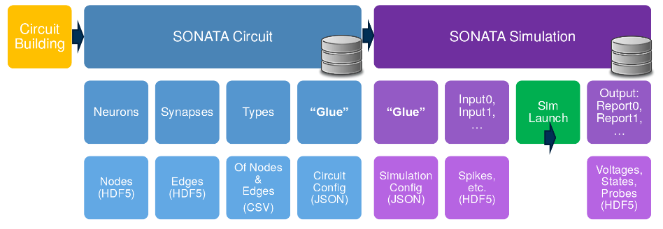
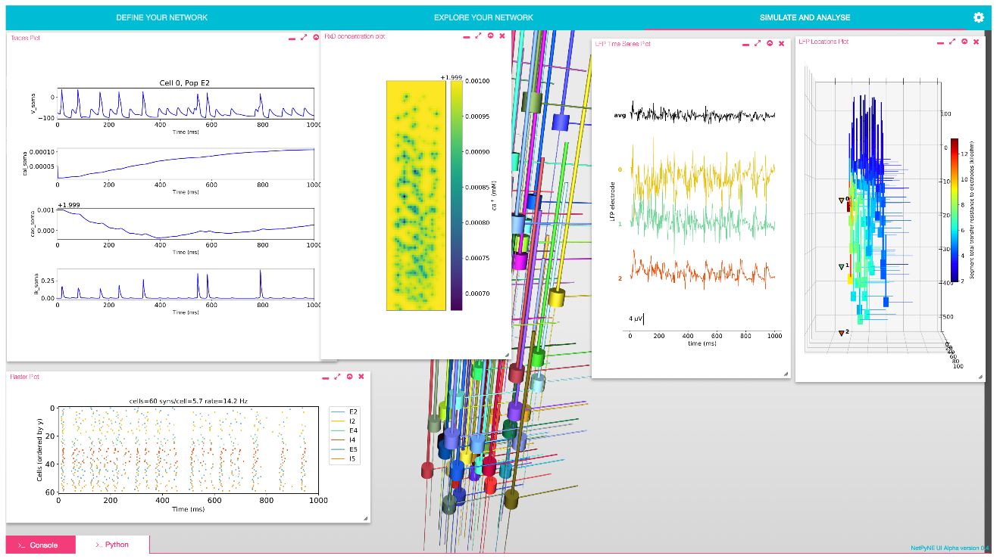

# Workshop report: Developing, standardising and sharing large scale cortical network models

*A workshop at CNS 2018, Tues 17th July, Allen Institute, Seattle*

## Background

A number of groups around the world are developing complex, experimentally constrained 
models of cortical function. Creating the software infrastructure to develop, simulate 
and share these types of models takes a significant amount of time for any of the groups 
involved and there can be a lot of overlap, duplication in work and repeated effort.

The purpose of this workshop was to highlight some of the initiatives currently underway to build 
detailed cortical models as well as those projects building the infrastructure to make 
it easier to develop, disseminate and compare the models. 

This workshop was the first activity of the [INCF Special Interest Group (SIG)](https://www.incf.org/activities/standards-and-best-practices/incf-special-interest-groups) on 
[Standardised Representations of Network Structures](https://www.incf.org/activities/standards-and-best-practices/incf-special-interest-groups/incf-sig-on-standardised). 
For more details on the current activities of this initiative, see [here](https://github.com/NeuralEnsemble/Networks_SIG). 

## Presentations

### Sacha van Albada

*Jülich Research Centre, Germany*

**Large scale model development from the [NEST](http://www.nest-simulator.org) perspective**

    

Sacha presented an overview of activities within the NEST community related to creating large scale models of networks constrained at multiple scales. 
She presented first the motivation for creating large scale models (with numbers of neurons closer to real networks) and the need for multiscale models, 
which can be compared to experimental data at the micro-, meso- and macroscale. The multilayer cortical network model of 
[Potjans and Diesmann (2014)](https://www.ncbi.nlm.nih.gov/pubmed/23203991) was described, which was originally developed in NEST, and has been ported to 
PyNN, Brian and Spinnaker, and is [available on OSB](http://www.opensourcebrain.org/projects/potjansdiesmann2014). 

The Potjans and Diesmann model has formed the basis of a multi area model of macaque visual cortex ([Schmidt et al., 2018](https://link.springer.com/article/10.1007/s00429-017-1554-4)). Sacha described the technical 
challenges of building a model of this complexity in NEST, the experimental data used to constrain the model, the activity of the simulated network as well as 
insights which can be gained from analysis of the connectivity of the model. The model, together with extensive documentation is available at https://github.com/INM-6/multi-area-model.

*Slides for this presentation are available [here](https://github.com/NeuralEnsemble/Networks_SIG/blob/master/docs/CNS2018/van_Albada_CNS2018_multi_area_model.pdf).*

### Anton Arkhipov1 and Eilif Muller2

*1: Allen Institute, Seattle, USA; 2: Blue Brain Project, Switzerland*

**Data-Driven Modeling of Brain Circuits and the [SONATA Data Format](https://github.com/AllenInstitute/sonata)**

    

Eilif and Anton presented joint work between the Allen Institute and the Blue Brain project 
to come up with a format for exchanging information on large scale simulations between the two initiatives. 

Anton first presented the work the Allen Institute is doing to acquire and release large scale experimental data in many domains including 
[connectivity](http://connectivity.brain-map.org/), [electrophysiology](http://celltypes.brain-map.org/) and 
[*in-vivo* activity](http://observatory.brain-map.org/visualcoding) in mice. He also described modelling tools being developed at Allen, including the [Brain Modeling Toolkit, BMTK](https://github.com/AllenInstitute/bmtk).

Eilif gave an overview of work in the [Blue Brain Project](https://bluebrain.epfl.ch/), including the neocortical microcircuit model as 
described in [Markram et al., 2015](https://www.ncbi.nlm.nih.gov/pubmed/26451489). He also discussed related work in the 
[Human Brain Project](https://www.ncbi.nlm.nih.gov/pubmed/26451489) to create large scale reconstructions of other brain regions including the hippocampus. 

Both of these projects are creating large scale simulations, and in order to share these between themselves and the community, as well as to 
help validate and reproduce the results, they have created a format [SONATA](https://github.com/AllenInstitute/sonata) which can 
encapsulate the structure of the model (cells and connectivity), as well as the output (voltage traces, spiketimes). 
The specification and examples in the format can be found at https://github.com/AllenInstitute/sonata.

*Slides for this presentation are available [here](https://github.com/NeuralEnsemble/Networks_SIG/blob/master/docs/CNS2018/2018-07-SONATA_Arkhipov_Muller.pdf).*

### Salvador Dura-Bernal

*SUNY Downstate Medical Center, Brooklyn, NY, USA*

**Development of large scale data-driven network models in [NetPyNE](http://www.netpyne.org/), a high-level interface to [NEURON](https://www.neuron.yale.edu/neuron)**

    

Salvador presented the latest developments with [NetPyNE](http://www.netpyne.org/), a high level interface to 
the Neuron simulator designed to make geenration, simulation and analysis of large scale network models easier for users. 
He presented the motivation for developing a new package like this, particularly the difficulty of 
incorporating realistic experimental data on cortical connectivity into network models. 

He discussed the high level format for NetPyNE, which makes it possible to specify the network in a compact, declarative fashion. 
He presented the options for running simulations using the package and analysing the results, using included methods. 
Import and export formats, including [NeuroML](http://www.neuroml.org) were outlined. 

A new graphical user interface (GUI) for NetPyNE has been developed and [released](https://github.com/MetaCell/NetPyNE-UI), 
to make it even easier for new users to get started with network modelling. 

He presented an example network developed in the package of the primary motor cortex, and showed some initial results from simulations of this large scale model (105 neurons).

*Slides for this presentation are available [here](https://github.com/NeuralEnsemble/Networks_SIG/blob/master/docs/CNS2018/CNS18_workshop_NetPyNE.pdf).*

### Padraig Gleeson

*University College London, UK*

**Large scale cortical models in [NeuroML](https://www.neuroml.org/) format on [Open Source Brain](http://www.opensourcebrain.org/)**

    

Padraig presented the latest developments with [NeuroML](http://www.neuroml.org), a standardised language in computational neuroscience 
for specifying models of cells, ion channels, synapses and 3D networks. The relationship between [NeuroML version 2 and LEMS](https://www.neuroml.org/lems_dev), a
language for machine readable model descriptions, was briefly outlined. 

The current functionality of the [Open Source Brain repository](http://www.opensourcebrain.org) was presented, 
along with an overview of the [range of models](http://www.opensourcebrain.org/projects) 
in NeuroML and [PyNN](http://neuralensemble.org/PyNN/) formats currently available on OSB. 
A recent manuscript released on bioRxiv ([Gleeson et al., 2018](https://www.biorxiv.org/content/early/2018/01/11/229484)) describes the
platform and some of the options for simulating and analysing the models through a web browser.

Some of the shortcomings of the current NeuroML specification in terms of high level network descriptions were discussed, 
and a new package, [NeuroMLlite](https://github.com/NeuroML/NeuroMLlite), was presented which seeks to address these. 
Current functionality, and mappings from the format into executable code, as well as graphical depictions of network connectivity, were shown.  

*Slides for this presentation are available [here](https://github.com/NeuralEnsemble/Networks_SIG/blob/master/docs/CNS2018/CNS2018-NeuroMLOSBCorticalModels.pdf).*

## Discussion and future plans

There was general agreement t

all open

Concrete steps going forward
nml-pynn
Sonata - NeuroML, PyNN, NetPyNE

Activities of the SIG will continue and the next online videoconference for the 

